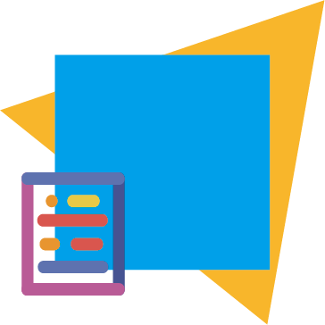

# 首页

| GitHub: [Kousaten](https://github.com/Kousaten) |
E-mail:<admin@kousaten.top> |

| QQ Group: [698353248](http://xsdggw.cn/t/web/baidu/?%E7%9F%A5%E9%81%93%E7%BE%A4%E5%8F%B7%E6%80%8E%E4%B9%88%E5%8A%A0%E5%85%A5qq%E7%BE%A4) |
Chat On [Gitter](https://gitter.im/Kousaten-Dev/community?utm_source=badge&utm_medium=badge&utm_campaign=pr-badge) |

> 展示项目的使用方法、项目结构等内容 —— 交差点官方文档

English | 中文繁體 | 日本語 | Esperanto

( Multiple language is not supported yet | 暫不支持多語言 | 複数の言語をサポートしていません | Ne subtenas plurajn lingvojn )

## 简介

一个编写、开发、保护开源软件的非盈利组织

Kousaten ❤️ Open Source

## 加入我们

使用上列任意一种方式联系到我们并表达你的决心

## 目录

- 开源贡献规范: [CONTRIBUTING](CONTRIBUTING.md)
- 代码编写规范: [coding-standards](coding-standards.md)
- 软件使用文档: [Brix](Brix.md)

## Contributors
